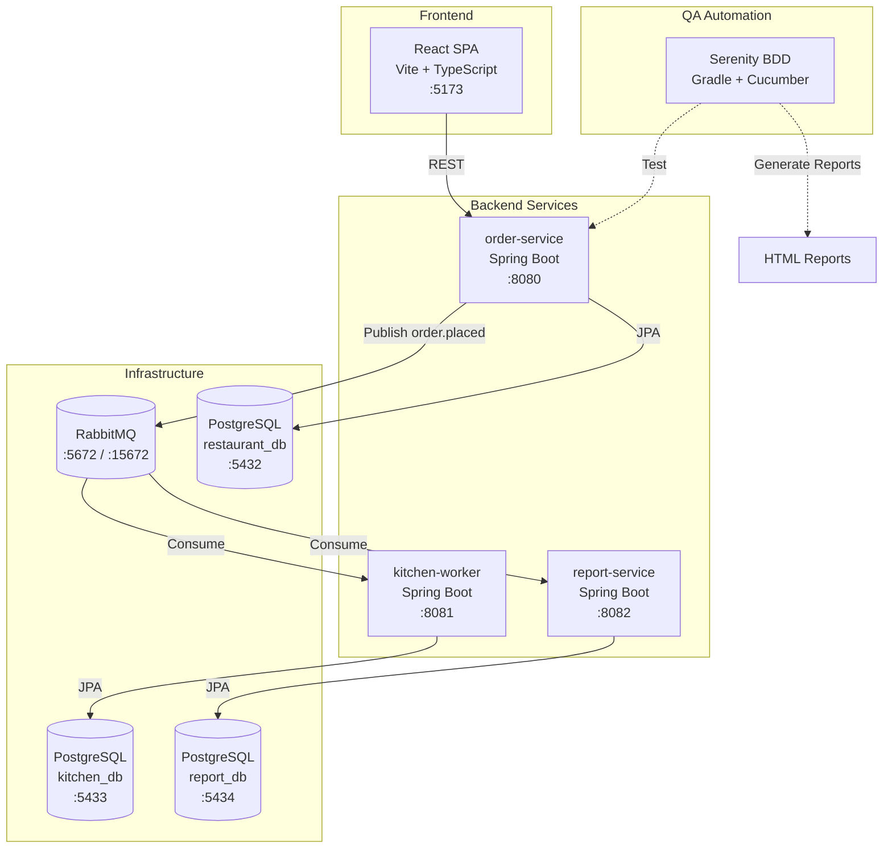
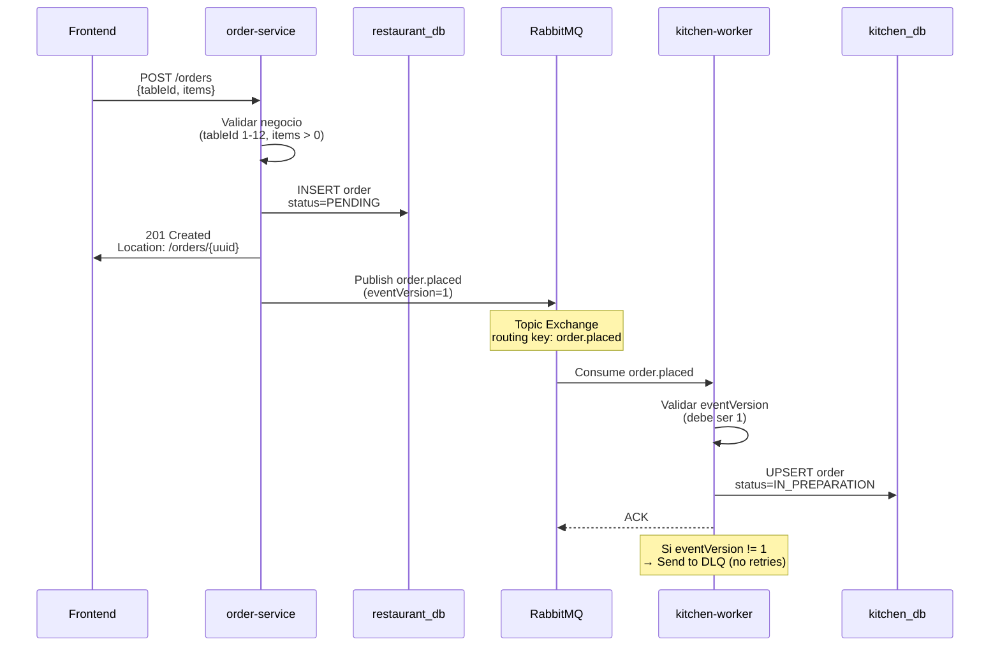
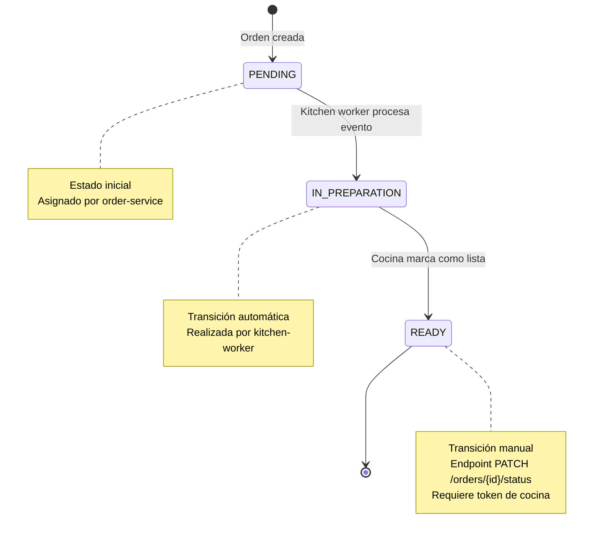

# 📋 Contexto del Proyecto — Sistema de Pedidos de Restaurante

**Fecha de actualización:** 3 de marzo de 2026  
**Versión:** 2.0  
**Estado:** Producción (MVP Funcional con Automatización QA)  
**Tipo de proyecto:** Full-Stack | Microservicios Event-Driven | Automatización de Pruebas

---

## 📑 Índice

1. [Resumen Ejecutivo](#1-resumen-ejecutivo)
2. [Arquitectura del Sistema](#2-arquitectura-del-sistema)
3. [Stack Tecnológico](#3-stack-tecnológico)
4. [Automatización de Pruebas (Serenity BDD)](#4-automatización-de-pruebas-serenity-bdd)
5. [Estructura del Proyecto](#5-estructura-del-proyecto)
6. [Reglas de Negocio](#6-reglas-de-negocio)
7. [Configuración y Deployment](#7-configuración-y-deployment)
8. [Documentación Relevante](#8-documentación-relevante)
9. [Próximos Pasos](#9-próximos-pasos)

---

## 1. Resumen Ejecutivo

### 1.1 Descripción del Proyecto

Sistema de gestión de pedidos para restaurante que **separa la lógica de toma de pedidos y preparación en cocina** mediante una arquitectura basada en eventos. El sistema permite:

- ✅ **Clientes:** Realizar pedidos a través de una interfaz web moderna
- ✅ **Personal de cocina:** Visualizar y gestionar pedidos en tiempo real
- ✅ **Administradores:** Generar reportes de ventas y métricas del negocio
- ✅ **QA:** Suite completa de pruebas automatizadas con Serenity BDD

### 1.2 Objetivos del Sistema

| Objetivo | Descripción | Estado |
|----------|-------------|--------|
| **Desacoplamiento** | Separar orden de pedido y preparación en servicios independientes | ✅ Completado |
| **Escalabilidad** | Arquitectura de microservicios con bases de datos independientes | ✅ Completado |
| **Comunicación asíncrona** | Eventos AMQP vía RabbitMQ (sin llamadas REST entre servicios) | ✅ Completado |
| **Resiliencia** | Dead Letter Queue (DLQ) con reintentos exponenciales | ✅ Completado |
| **Calidad** | Automatización de pruebas con Serenity BDD + Cucumber | ✅ Completado |
| **Documentación viva** | Reportes HTML enriquecidos generados automáticamente | ✅ Completado |

### 1.3 Alcance Funcional

#### Funcionalidades Implementadas
- ✅ Gestión de menú (productos activos/inactivos)
- ✅ Creación de órdenes con validación de negocio
- ✅ Procesamiento asíncrono de pedidos
- ✅ Cambio de estados de órdenes (PENDING → IN_PREPARATION → READY)
- ✅ Autenticación de cocina con token
- ✅ Reportes de ventas por rango de fechas
- ✅ Soft delete (eliminación lógica de órdenes)
- ✅ Suite de pruebas automatizadas E2E

#### Fuera de Alcance (Versión Actual)
- ❌ Autenticación de usuarios (clientes/meseros)
- ❌ Gestión de mesas (reservas, disponibilidad)
- ❌ Pagos y facturación
- ❌ Notificaciones push/websockets
- ❌ Multi-tenant (múltiples restaurantes)

---

## 2. Arquitectura del Sistema

### 2.1 Diagrama de Arquitectura



### 2.2 Principios Arquitectónicos

| Principio | Implementación | Justificación |
|-----------|----------------|---------------|
| **Database per Service** | 3 bases de datos PostgreSQL independientes | Autonomía de servicios, escalabilidad |
| **Event-Driven** | RabbitMQ con topic exchange `orders.topic` | Desacoplamiento temporal, resiliencia |
| **API-First** | OpenAPI/Swagger en order-service | Contrato explícito, documentación viva |
| **CQRS Lite** | report-service con modelo de lectura separado | Optimización de consultas, desnormalización controlada |
| **Hexagonal (Parcial)** | Puertos/Adaptadores en capa de eventos | Testabilidad, inversión de dependencias |
| **Soft Delete** | Campo `deleted` en órdenes | Auditoría, recuperación de datos |

### 2.3 Reglas de Comunicación

#### ✅ Permitido
- Frontend → order-service: **REST HTTP**
- order-service → kitchen-worker: **RabbitMQ (evento `order.placed`)**
- order-service → report-service: **RabbitMQ (evento `order.placed`)**

#### ❌ Prohibido
- Llamadas REST directas entre servicios backend
- Acceso cruzado a bases de datos
- Estado compartido en memoria

### 2.4 Flujo de Creación de Orden



---

## 3. Stack Tecnológico

### 3.1 Backend

| Tecnología | Versión | Uso | Servicios |
|------------|---------|-----|-----------|
| **Java** | 17 | Lenguaje principal | Todos |
| **Spring Boot** | 3.2.0 | Framework base | Todos |
| **Spring Data JPA** | 3.2.0 | ORM / Persistencia | Todos |
| **Spring AMQP** | 3.1.0 | Cliente RabbitMQ | Todos |
| **Spring Validation** | 3.2.0 | Bean Validation | order-service |
| **PostgreSQL** | 15 | Base de datos | Todos (3 instancias) |
| **Flyway** | 9.22.0 | Migraciones DB | Todos |
| **Lombok** | 1.18.30 | Reducción boilerplate | Todos |
| **SpringDoc OpenAPI** | 2.2.0 | Documentación Swagger | order-service |
| **Maven** | 3.9+ | Gestión de dependencias | Todos |

### 3.2 Frontend

| Tecnología | Versión | Uso |
|------------|---------|-----|
| **React** | 18.2.0 | Framework UI |
| **TypeScript** | 5.0+ | Type safety |
| **Vite** | 4.5.0 | Build tool |
| **TailwindCSS** | 3.3.0 | Styling |
| **TanStack Query** | 5.x | Server state management |
| **React Router** | 6.x | Routing |

### 3.3 Infrastructure

| Tecnología | Versión | Uso |
|------------|---------|-----|
| **RabbitMQ** | 3.12 | Message broker (AMQP) |
| **Docker** | 24.0+ | Containerización |
| **Docker Compose** | 2.20+ | Orquestación local |

### 3.4 QA & Automation

| Tecnología | Versión | Uso |
|------------|---------|-----|
| **Serenity BDD** | 4.2.12 | Framework de automatización |
| **Cucumber** | 7.20.1 | BDD (Gherkin) |
| **JUnit 5** | 5.11.4 | Motor de pruebas |
| **REST Assured** | 5.5.0 | Testing de APIs REST |
| **AssertJ** | 3.27.3 | Assertions fluidas |
| **Gradle** | 8.14 | Build tool (Serenity) |

---

## 4. Automatización de Pruebas (Serenity BDD)

### 4.1 Propósito

Suite de pruebas **end-to-end automatizadas** que valida:
- ✅ Contratos REST HTTP (códigos de estado, headers, estructura JSON)
- ✅ Semántica HTTP correcta (201 Created + Location header)
- ✅ Validaciones de negocio (tableId, items, productId)
- ✅ Manejo de errores (estructura ErrorResponse)
- ✅ Documentación viva (reportes HTML enriquecidos)

### 4.2 Estructura del Proyecto Serenity

```
Serenity/
├── build.gradle                    # Configuración Gradle (Java 17, dependencias)
├── gradle.properties               # Encoding UTF-8 (crítico para Gherkin español)
├── settings.gradle                 # Nombre del proyecto
├── src/test/
│   ├── java/com/restaurant/qa/
│   │   ├── runners/
│   │   │   └── TestRunner.java             # Punto de entrada JUnit 5
│   │   └── stepdefinitions/
│   │       ├── OrderStepDefinitions.java   # Implementación de pasos Gherkin
│   │       └── CucumberHooks.java          # Hooks @Before/@After
│   └── resources/
│       ├── serenity.conf                   # Configuración de entornos
│       ├── cucumber.properties             # Enlace Cucumber-Serenity
│       ├── logback-test.xml                # Configuración de logs
│       └── features/
│           └── order_service/
│               └── HDU01_create_order.feature  # Escenarios BDD en español
└── target/site/serenity/
    └── index.html                          # Reporte HTML (generado)
```

### 4.3 Cobertura de Pruebas

#### Tags Implementados
- `@HDU-01`: Creación de recursos con semántica HTTP correcta
- `@smoke`: Pruebas críticas (subset para ejecución rápida)
- `@regression`: Suite completa de regresión
- `@wip`: Work in progress (excluidas por defecto)

#### Escenarios Implementados
1. **Crear orden exitosamente retorna 201 con Location** (@smoke)
   - Valida código 201
   - Verifica header Location con patrón `/orders/{uuid}`
   - Confirma estado inicial `PENDING`
   - Valida Content-Type `application/json`

2. **La URL del header Location es accesible**
   - Verifica que GET al Location retorna 200
   - Confirma mismo ID de orden

3. **Creación fallida no incluye header Location**
   - TableId inválido (0) → 400 Bad Request
   - Sin header Location en errores
   - Estructura ErrorResponse válida

### 4.4 Comandos de Ejecución

```bash
# Ir al directorio de Serenity
cd Serenity/

# Ejecutar TODAS las pruebas
gradlew.bat clean test aggregate

# Ejecutar solo pruebas SMOKE (rápidas)
gradlew.bat smoke

# Ejecutar pruebas de REGRESIÓN
gradlew.bat regression

# Ejecutar pruebas por TAG específico
gradlew.bat hdu -Ptag=HDU-01

# Abrir el reporte HTML
start target\site\serenity\index.html
```

### 4.5 Configuración de Entornos

Definidos en `serenity.conf`:

| Entorno | URL Base | Token Cocina | Uso |
|---------|----------|--------------|-----|
| **default** (local) | http://localhost:8080 | valid-kitchen-token | Desarrollo local |
| **staging** | https://staging.restaurant.com | ${KITCHEN_TOKEN} | Pre-producción |
| **ci** | http://order-service:8080 | ${CI_KITCHEN_TOKEN} | Pipelines CI/CD |

Cambiar de entorno:
```bash
gradlew.bat test -Denvironment=staging
```

### 4.6 Reportes Generados

#### Reporte Principal (Serenity BDD)
```
target/site/serenity/index.html
```

**Contenido:**
- Dashboard con estadísticas de ejecución
- Escenarios organizados por features y tags
- Detalles de cada paso con request/response HTTP completos
- Gráficos de cobertura y tendencias
- Trazabilidad de requisitos

#### Reporte JUnit (XML)
```
build/test-results/test/*.xml
```

#### Reporte Gradle (HTML)
```
build/reports/tests/test/index.html
```

---

## 5. Estructura del Proyecto

### 5.1 Repositorios

| Repositorio | Contenido | Tecnología |
|-------------|-----------|------------|
| **Sistemas-de-pedidos-restaurante-backend** | Microservicios + Infrastructure + QA | Java 17 + Spring Boot |
| **Sistemas-de-pedidos-restaurante-frontend** | SPA cliente y cocina | React + TypeScript |

### 5.2 Módulos Backend

```
Sistemas-de-pedidos-restaurante-backend/
├── order-service/              # Servicio principal REST
│   ├── src/main/java/com/restaurant/orderservice/
│   │   ├── controller/         # Endpoints REST
│   │   ├── service/            # Lógica de negocio
│   │   ├── repository/         # Acceso a datos (JPA)
│   │   ├── entity/             # Entidades JPA
│   │   ├── dto/                # DTOs request/response
│   │   ├── domain/             # Modelos de dominio
│   │   ├── application/        # Casos de uso
│   │   ├── infrastructure/     # Adaptadores técnicos
│   │   ├── security/           # Autenticación cocina
│   │   ├── config/             # Configuración Spring
│   │   └── exception/          # Manejo de errores
│   └── src/test/java/          # Tests unitarios + integración
│
├── kitchen-worker/             # Consumidor de eventos
│   ├── src/main/java/
│   │   ├── consumer/           # Listeners RabbitMQ
│   │   ├── service/            # Procesamiento eventos
│   │   ├── repository/         # Persistencia kitchen_db
│   │   └── config/             # Configuración AMQP
│   └── src/test/java/
│
├── report-service/             # Reportes y métricas
│   ├── src/main/java/
│   │   ├── controller/         # Endpoints reportes
│   │   ├── service/            # Agregación de datos
│   │   ├── repository/         # Acceso report_db
│   │   └── consumer/           # Listener eventos
│   └── src/test/java/
│
├── Serenity/                   # Automatización QA (NUEVO)
│   ├── build.gradle
│   ├── src/test/
│   │   ├── java/               # Step definitions
│   │   └── resources/
│   │       └── features/       # Archivos .feature
│   └── target/site/serenity/   # Reportes HTML
│
├── infrastructure/
│   ├── docker/
│   │   └── docker-compose.yml  # Orquestación servicios
│   └── database/
│       └── migrations/         # Scripts SQL iniciales
│
├── docs/                       # Documentación técnica
│   ├── HANDOVER_REPORT.md      # Reporte de handover
│   ├── ARCHITECTURE.md         # Decisiones arquitectónicas
│   ├── TEST_PLAN.md            # Plan de pruebas
│   ├── GUIA_ENDPOINTS_Y_DB.md  # Referencia API + DB
│   └── Serenity BDD/
│       ├── guia_serenity_bdd.md            # Guía completa Serenity
│       └── Anatomia_del_proyecto.md        # Explicación estructura
│
├── pom.xml                     # Parent POM (multi-módulo)
└── README.md                   # Guía de inicio rápido
```

### 5.3 Arquitectura de order-service

```
order-service/src/main/java/com/restaurant/orderservice/

🎯 Capa de Presentación (API REST)
├── controller/
│   ├── OrderController.java            # CRUD órdenes
│   ├── MenuController.java             # Consulta menú
│   └── exception/
│       └── GlobalExceptionHandler.java # Manejo errores REST

🧠 Capa de Aplicación (Casos de Uso)
├── application/
│   ├── OrderCommandExecutor.java       # Orquestador comandos
│   ├── PublishOrderPlacedEventCommand.java
│   └── port/
│       └── OrderPlacedEventPublisherPort.java  # Puerto salida (Hexagonal)

💼 Capa de Dominio
├── domain/
│   ├── Order.java                      # Entidad de dominio
│   ├── OrderItem.java
│   ├── OrderPlacedDomainEvent.java     # Evento de dominio
│   └── OrderStatus.java                # Enum estados

🔧 Capa de Servicio
├── service/
│   ├── OrderService.java               # Lógica negocio órdenes
│   ├── MenuService.java                # Lógica negocio menú
│   └── OrderValidator.java             # Validaciones complejas

🗄️ Capa de Persistencia
├── repository/
│   ├── OrderRepository.java            # Spring Data JPA
│   └── ProductRepository.java

📦 DTOs (Contratos API)
├── dto/
│   ├── CreateOrderRequest.java         # Request POST /orders
│   ├── OrderResponse.java              # Response órdenes
│   ├── UpdateOrderStatusRequest.java
│   └── ErrorResponse.java              # Estructura error unificada

🏗️ Infraestructura (Adaptadores)
├── infrastructure/
│   ├── messaging/
│   │   └── RabbitOrderPlacedEventPublisher.java  # Adaptador RabbitMQ
│   └── persistence/
│       └── OrderEntity.java            # Entidad JPA

🔐 Seguridad
├── security/
│   ├── KitchenAuthenticationFilter.java
│   └── handler/                        # Chain of Responsibility
│       ├── KitchenEndpointScopeHandler.java
│       ├── KitchenTokenPresenceHandler.java
│       └── KitchenTokenValueHandler.java

⚙️ Configuración
└── config/
    ├── RabbitMQConfig.java             # Topic exchange + DLQ
    ├── OpenApiConfig.java              # Swagger UI
    └── CorsConfig.java                 # CORS policy
```

---

## 6. Reglas de Negocio

### 6.1 Validaciones de Órdenes

| Campo | Validación | Error |
|-------|------------|-------|
| `tableId` | Debe ser entre 1 y 12 (inclusive) | 400 Bad Request |
| `items` | Debe contener al menos 1 item | 400 Bad Request |
| `items[].productId` | Debe existir en la tabla `products` | 404 Not Found |
| `items[].productId` | Producto debe estar activo (`is_active = true`) | 422 Unprocessable Entity |
| `items[].quantity` | Debe ser >= 1 | 400 Bad Request |

### 6.2 Estados de Órdenes



### 6.3 Seguridad de Cocina

**Endpoints Protegidos:**
- `PATCH /orders/{id}/status` → Cambiar estado orden
- `DELETE /orders/{id}` → Eliminar orden específica (soft delete)
- `DELETE /orders` → Eliminar todas las órdenes (operación destructiva)

**Mecanismo:**
- Header requerido: `X-Kitchen-Token`
- Valor: Configurado en variable de entorno `KITCHEN_AUTH_TOKEN`
- Implementación: Chain of Responsibility con 3 handlers

**Flujo de Validación:**
```
Request → KitchenEndpointScopeHandler 
       → KitchenTokenPresenceHandler 
       → KitchenTokenValueHandler 
       → Controller
```

### 6.4 Contrato de Eventos

#### Evento: `order.placed`

**Versión:** 1 (Estricta)

```json
{
  "eventVersion": 1,              // DEBE ser exactamente 1
  "orderId": "uuid",              // UUID de la orden
  "tableId": 5,                   // Número de mesa (1-12)
  "status": "PENDING",            // Estado inicial
  "createdAt": "2026-03-03T10:30:00",
  "items": [
    {
      "productId": 1,
      "productName": "Pizza Margherita",
      "quantity": 2,
      "price": 12.99,
      "note": "Sin cebolla"
    }
  ]
}
```

**Regla Crítica:**
- Si `eventVersion != 1` → Enviar directamente a DLQ (sin reintentos)
- Razón: Cambios incompatibles en el esquema del evento

### 6.5 Idempotencia del Kitchen Worker

El kitchen-worker implementa **upsert** (insert or update):

```sql
-- Si la orden NO existe → INSERT
-- Si la orden YA existe → Ignorar (idempotencia)
```

**Justificación:** Reintentos de RabbitMQ pueden causar duplicados. El worker maneja reintentos de forma segura.

---

## 7. Configuración y Deployment

### 7.1 Variables de Entorno

#### order-service
```bash
SERVER_PORT=8080
DB_URL=jdbc:postgresql://localhost:5432/restaurant_db
DB_USER=restaurant_user
DB_PASS=restaurant_pass
KITCHEN_TOKEN_HEADER=X-Kitchen-Token
KITCHEN_AUTH_TOKEN=cocina123
CORS_ALLOWED_ORIGINS=http://localhost:5173
RABBITMQ_HOST=localhost
RABBITMQ_PORT=5672
RABBITMQ_USERNAME=guest
RABBITMQ_PASSWORD=guest
```

#### kitchen-worker
```bash
SERVER_PORT=8081
KITCHEN_DB_URL=jdbc:postgresql://localhost:5433/kitchen_db
KITCHEN_DB_USER=kitchen_user
KITCHEN_DB_PASS=kitchen_pass
RABBITMQ_HOST=localhost
```

#### report-service
```bash
SERVER_PORT=8082
REPORT_DB_URL=jdbc:postgresql://localhost:5434/report_db
REPORT_DB_USER=report_user
REPORT_DB_PASS=report_pass
RABBITMQ_HOST=localhost
```

### 7.2 Puertos Utilizados

| Servicio | Puerto | Descripción |
|----------|--------|-------------|
| Frontend | 5173 | Vite dev server |
| order-service | 8080 | API REST principal |
| kitchen-worker | 8081 | Worker (sin HTTP) |
| report-service | 8082 | API reportes |
| PostgreSQL (restaurant) | 5432 | Base de datos principal |
| PostgreSQL (kitchen) | 5433 | Base de datos cocina |
| PostgreSQL (report) | 5434 | Base de datos reportes |
| RabbitMQ | 5672 | AMQP broker |
| RabbitMQ Management | 15672 | Panel web (guest/guest) |

### 7.3 Levantar el Sistema con Docker

```bash
# 1. Clonar repositorio
git clone <url-backend>
cd Sistemas-de-pedidos-restaurante-backend

# 2. Levantar servicios
cd infrastructure/docker
docker-compose up -d

# 3. Verificar estado
docker-compose ps

# 4. Ver logs
docker-compose logs -f order-service

# 5. Acceder a servicios
# - API: http://localhost:8080
# - Swagger: http://localhost:8080/swagger-ui.html
# - RabbitMQ: http://localhost:15672 (guest/guest)
```

### 7.4 Ejecutar Pruebas Localmente

```bash
# 1. Asegurar que order-service esté corriendo
curl http://localhost:8080/menu

# 2. Ir al directorio de Serenity
cd Serenity/

# 3. Ejecutar pruebas
gradlew.bat clean test aggregate

# 4. Ver reporte
start target\site\serenity\index.html
```

---

## 8. Documentación Relevante

### 8.1 Documentación Técnica

| Documento | Ubicación | Descripción |
|-----------|-----------|-------------|
| **README.md** | `/README.md` | Guía rápida de inicio |
| **HANDOVER_REPORT.md** | `/docs/HANDOVER_REPORT.md` | Reporte de handover (legacy) |
| **ARCHITECTURE.md** | `/docs/week-3-review/ARCHITECTURE.md` | Decisiones arquitectónicas |
| **REST_API_AUDIT.md** | `/docs/week-3-review/REST_API_AUDIT.md` | Auditoría de API REST |
| **TEST_PLAN.md** | `/docs/TEST_PLAN.md` | Plan de pruebas |
| **GUIA_ENDPOINTS_Y_DB.md** | `/docs/GUIA_ENDPOINTS_Y_DB.md` | Referencia API + esquema DB |
| **DEUDA_TECNICA.md** | `/docs/quality/DEUDA_TECNICA.md` | Registro de deuda técnica |

### 8.2 Documentación Serenity BDD

| Documento | Ubicación | Descripción |
|-----------|-----------|-------------|
| **guia_serenity_bdd.md** | `/docs/Serenity BDD/guia_serenity_bdd.md` | Guía completa de Serenity |
| **Anatomia_del_proyecto.md** | `/docs/Serenity BDD/Anatomia_del_proyecto.md` | Explicación de estructura |

### 8.3 Swagger / OpenAPI

- **URL:** http://localhost:8080/swagger-ui.html
- **JSON Spec:** http://localhost:8080/v3/api-docs

---

## 9. Próximos Pasos

### 9.1 Mejoras Planificadas

#### Corto Plazo (Sprint Actual)
- [ ] Expandir cobertura de pruebas Serenity (HDU-02 a HDU-08)
- [ ] Implementar pruebas de integración asíncrona (RabbitMQ + kitchen-worker)
- [ ] Agregar pruebas de report-service
- [ ] Mejorar manejo de errores en report-service (agregar @RestControllerAdvice)

#### Mediano Plazo
- [ ] Integración con CI/CD (GitHub Actions / Jenkins)
- [ ] Property-based testing con jqwik
- [ ] Pruebas de carga con JMeter / Gatling
- [ ] Contract testing con Pact (consumer-driven)
- [ ] Observabilidad (OpenTelemetry + Jaeger)

#### Largo Plazo
- [ ] Migración a arquitectura hexagonal completa
- [ ] Schema Registry para eventos (Avro/Protobuf)
- [ ] Event Sourcing en order-service
- [ ] Autenticación OAuth2/JWT para clientes
- [ ] Websockets para notificaciones en tiempo real

### 9.2 Deuda Técnica Conocida

| Categoría | Descripción | Prioridad | Ticket |
|-----------|-------------|-----------|--------|
| **Seguridad** | Token de cocina en variable de entorno (debería ser secreto rotable) | Alta | DT-001 |
| **Validación** | `@Max(12)` faltante en validación de `tableId` | Media | DT-002 |
| **Documentación** | OpenAPI faltante en report-service | Media | DT-003 |
| **Testing** | Cobertura de código < 80% en kitchen-worker | Baja | DT-004 |
| **Observabilidad** | Falta distributed tracing | Media | DT-005 |

### 9.3 Contactos y Roles

| Rol | Nombre | Responsabilidad | Contacto |
|-----|--------|----------------|----------|
| **Tech Lead** | [Nombre] | Decisiones arquitectónicas | [email] |
| **QA Lead** | [Nombre] | Estrategia de pruebas | [email] |
| **DevOps** | [Nombre] | Infraestructura y deployment | [email] |
| **Product Owner** | [Nombre] | Definición de requisitos | [email] |

---

## 📌 Notas Finales

### Contexto de Handover (Brownfield)

Este proyecto fue recibido como **legacy handover** con las siguientes restricciones:

⚠️ **Reglas Críticas:**
- ❌ NO asumir greenfield
- ❌ NO romper funcionalidad existente
- ❌ NO cambiar contratos externos silenciosamente (REST, AMQP, DB schemas)

✅ **Refactorización Permitida:**
- Mejoras de seguridad (reemplazo de secretos hardcoded)
- Centralización de lógica de autorización
- Migración de validaciones del frontend al backend
- Introducción de tests que validen reglas de seguridad

### Principios de Desarrollo

1. **Test-Driven Development (TDD) es obligatorio**
   - Tests PRIMERO, código DESPUÉS
   - Commit history: RED → GREEN → REFACTOR

2. **Backend enforcement**
   - No confiar en validaciones del frontend
   - Backend es la única fuente de verdad

3. **Documentación viva**
   - Los tests son documentación ejecutable
   - Los reportes de Serenity son la especificación viviente

4. **Seguridad por defecto**
   - Operaciones destructivas requieren confirmación
   - Soft delete sobre hard delete
   - Audit logging obligatorio

---

**Última actualización:** 3 de marzo de 2026  
**Versión del documento:** 2.0  
**Mantenedor:** Equipo QA Automation

---

## 📚 Referencias Adicionales

- [Serenity BDD Official Docs](https://serenity-bdd.info/)
- [Cucumber Reference](https://cucumber.io/docs/cucumber/)
- [Spring AMQP Documentation](https://docs.spring.io/spring-amqp/reference/)
- [RabbitMQ Best Practices](https://www.rabbitmq.com/best-practices.html)
- [REST API Design Guidelines](https://restfulapi.net/)
- [GitHub Copilot Instructions](.github/copilot-instructions.md)

---

> 💡 **Tip:** Este documento debe actualizarse cada vez que se agreguen nuevos servicios, cambien contratos de API, o se implementen nuevas features. Mantener la documentación al día es responsabilidad de TODO el equipo.
