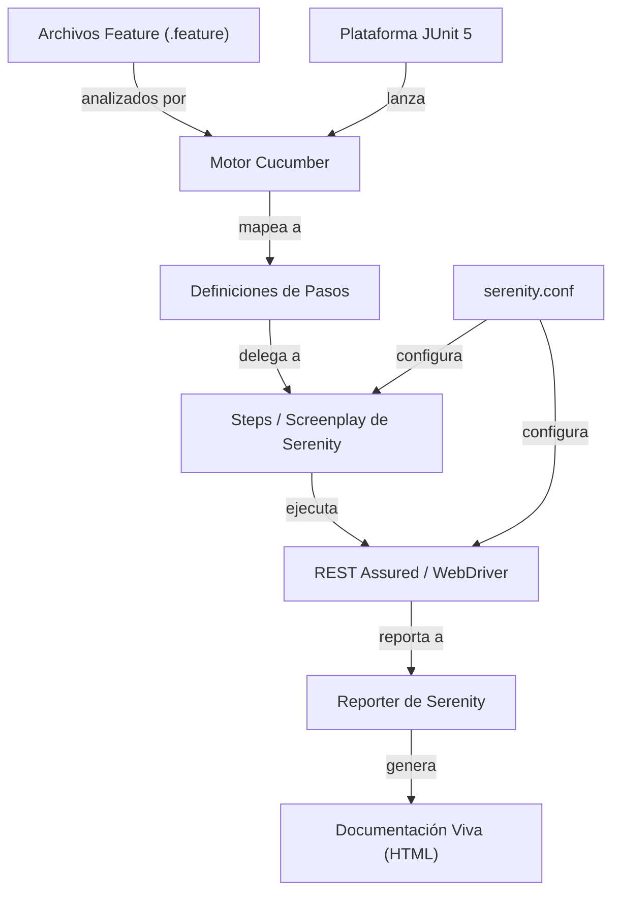
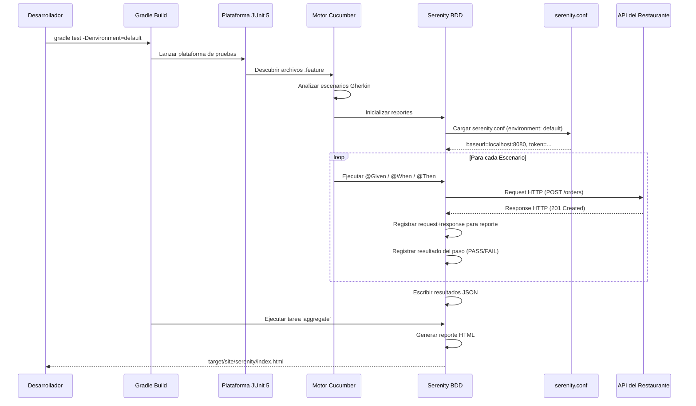
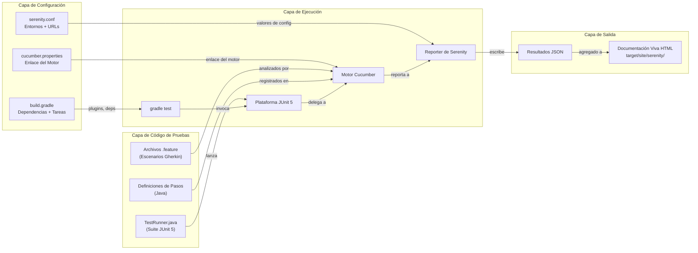

# Serenity BDD — Guía Completa de Configuración e Implementación

**Para:** Sistema de Pedidos de Restaurante — Automatización QA  
**Fecha:** 6 de marzo de 2026  
**Contexto:** Proyecto Serenity BDD basado en Gradle para pruebas de API REST

---

## Tabla de Contenido

1. [Conceptos de Automatización de Pruebas y Serenity BDD](#1-conceptos-de-automatización-de-pruebas-y-serenity-bdd)
2. [build.gradle — Configuración Lista para Producción](#2-buildgradle--configuración-lista-para-producción)
3. [serenity.conf — Configuración de Entorno y Driver](#3-serenityconf--configuración-de-entorno-y-driver)
4. [Cómo se Conecta Todo](#4-cómo-se-conecta-todo)
5. [Mejores Prácticas para Escalar](#5-mejores-prácticas-para-escalar)

---

## 1. Conceptos de Automatización de Pruebas y Serenity BDD

### 1.1 ¿Qué es Serenity BDD?

Serenity BDD (anteriormente Thucydides) es una **librería de código abierto** diseñada para hacer que la escritura de pruebas automatizadas de aceptación, regresión e integración sea más rápida y mantenible. A diferencia de frameworks de pruebas crudos (JUnit, TestNG), Serenity añade una **capa de abstracción** que produce **documentación viva** — reportes HTML enriquecidos que narran qué hace tu aplicación y cómo fue probada.

> [!IMPORTANT]
> Serenity BDD no es solo una herramienta de pruebas — es un **framework de automatización de pruebas** que impone buenas prácticas de ingeniería a través de su Patrón Screenplay y su reporte a nivel de pasos.

### 1.2 Beneficios de la Automatización Estilo BDD

| Beneficio | Cómo Serenity lo Entrega |
|---|---|
| **Lenguaje compartido** | Gherkin (archivos `.feature`) cierra la brecha entre QA, DEV y Producto. Los escenarios de tu plan de pruebas (HDU-01 a HDU-08) se traducen directamente en Gherkin ejecutable. |
| **Documentación viva** | Cada ejecución de pruebas produce reportes HTML enriquecidos con capturas de pantalla, logs de llamadas REST y narrativas paso a paso. Los stakeholders pueden verificar la cobertura sin leer código. |
| **Mantenibilidad** | El Patrón Screenplay separa *qué* hace el usuario (Tareas) de *cómo* se hace (Interacciones), reduciendo el código de pruebas frágil. |
| **Trazabilidad** | Serenity rastrea qué requisitos están cubiertos por qué pruebas, vinculándose directamente a tus anotaciones `@CucumberOptions(tags = "@HDU-01")`. |
| **Profundidad de reportes** | La integración con REST Assured registra automáticamente cada par request/response HTTP — perfecto para tus pruebas de contrato de API REST. |

### 1.3 Cómo Serenity se Integra con Cucumber y JUnit

Serenity actúa como una **capa puente** entre Cucumber (para escenarios BDD) y JUnit (como motor de ejecución de pruebas):



**Puntos clave de integración:**

1. **Lanzador de Plataforma JUnit 5** — Serenity usa `@Suite` con `@ConfigurationParameter` para engancharse al motor Cucumber vía la plataforma JUnit 5. Esto reemplaza el enfoque anterior `@RunWith(CucumberWithSerenity.class)`.

2. **Definiciones de Pasos de Cucumber** — Son métodos Java simples anotados con `@Given`, `@When`, `@Then` que Cucumber mapea desde tus archivos `.feature`. Serenity los *envuelve* para añadir reportes, capturas de pantalla y rastreo de pasos.

3. **Métodos `@Step` de Serenity** — Acciones reutilizables a nivel de negocio. Cada método `@Step` se registra automáticamente en el reporte, creando una narrativa de prueba legible para humanos.

4. **Integración con REST Assured** — La clase `SerenityRest` de Serenity envuelve REST Assured para registrar todas las interacciones HTTP. Esto es crítico para tus pruebas de contrato de API (por ejemplo, validar la estructura `ErrorResponse` en todos los endpoints).

### 1.4 Principios Clave

#### Documentación Viva
Cada vez que ejecutas tu suite de pruebas, Serenity genera un reporte HTML comprehensivo que incluye:
- **Resultados de pruebas** organizados por feature/tag/capacidad
- **Narrativa paso a paso** de lo que hizo cada prueba
- **Detalles de llamadas API REST** (headers de request, body, response)
- **Cobertura de requisitos** mostrando qué features están probadas y cuáles no
- **Estadísticas** — conteos de aprobados/fallidos/pendientes/omitidos

Este reporte reemplaza la documentación estática de pruebas — siempre está actualizado porque se genera a partir de la ejecución real de las pruebas.

#### Mantenibilidad vía el Patrón Screenplay
En lugar de monolitos de page-objects o definiciones de pasos frágiles, Serenity promueve:

| Concepto | Propósito | Ejemplo para tu proyecto |
|---|---|---|
| **Actor** | Quién realiza la acción | `Actor chef = Actor.named("Chef");` |
| **Tarea (Task)** | Objetivo de negocio de alto nivel | `CreateOrder.forTable(5).withProduct(1)` |
| **Pregunta (Question)** | Consulta el estado del sistema | `TheOrder.status()` retorna `"PENDING"` |
| **Interacción (Interaction)** | Acción técnica de bajo nivel | `Post.to("/orders").with(body)` |
| **Habilidad (Ability)** | Lo que el actor puede hacer | `chef.whoCan(CallAnApi.at(baseUrl))` |

#### Reportes Enriquecidos
Los reportes de Serenity no son solo listas de aprobado/fallido. Cuentan una **historia**:

```
✅ POST /orders — Crear Orden Exitosamente
   1. Dado que el catálogo de productos contiene producto activo con id 1  ✓
   2. Cuando se envía una solicitud POST a "/orders" con payload válido  ✓
      → POST http://localhost:8080/orders
      → Request: {"tableId":5,"items":[{"productId":1,"quantity":2}]}
      → Response: 201 Created
      → {"id":"a1b2c3...","status":"PENDING","items":[...]}
   3. Entonces el código de respuesta debe ser 201  ✓
   4. Y el header Location debe coincidir con "/orders/{uuid}"  ✓
```

---

## 2. build.gradle — Configuración Lista para Producción

Este `build.gradle` está diseñado para **pruebas de API** de tu Sistema de Pedidos de Restaurante. Integra Serenity BDD con Cucumber 7 y JUnit 5, y está estructurado para fácil extensión.

```groovy
// =============================================================================
// build.gradle — Serenity BDD + Cucumber + JUnit 5 (Pruebas de API)
// Proyecto: Sistema de Pedidos de Restaurante — Automatización QA
// =============================================================================

plugins {
    id 'java'
    id 'net.serenity-bdd.serenity-gradle-plugin' version '4.2.12'
}

// ---------------------------------------------------------------------------
// Codificación por defecto y nomenclatura
// ---------------------------------------------------------------------------
defaultTasks 'clean', 'test', 'aggregate'

// ---------------------------------------------------------------------------
// Versión de Java — usando Java 24 del sistema
// ---------------------------------------------------------------------------
java {
    sourceCompatibility = JavaVersion.VERSION_24
    targetCompatibility = JavaVersion.VERSION_24
}

// ---------------------------------------------------------------------------
// Catálogo de versiones — gestión centralizada de dependencias
// ---------------------------------------------------------------------------
ext {
    serenityVersion       = '4.2.12'
    cucumberVersion       = '7.20.1'
    junitVersion          = '5.11.4'
    restAssuredVersion    = '5.5.0'
    lombokVersion         = '1.18.36'
    assertjVersion        = '3.27.3'
    logbackVersion        = '1.5.16'
    slf4jVersion          = '2.0.16'
}

// ---------------------------------------------------------------------------
// Repositorios
// ---------------------------------------------------------------------------
repositories {
    mavenCentral()
}

// ---------------------------------------------------------------------------
// Dependencias
// ---------------------------------------------------------------------------
dependencies {

    // ── Serenity BDD Core ──────────────────────────────────────────────────
    // La librería central proporciona rastreo de pasos, agregación y el
    // Patrón Screenplay. Este es el corazón de Serenity.
    implementation "net.serenity-bdd:serenity-core:${serenityVersion}"

    // ── Integración Serenity + Cucumber ────────────────────────────────────
    // Conecta el parser Gherkin de Cucumber con el motor de reportes
    // de Serenity. Esto es lo que hace que tus archivos .feature
    // produzcan reportes HTML enriquecidos.
    implementation "net.serenity-bdd:serenity-cucumber:${serenityVersion}"

    // ── Serenity + REST Assured ────────────────────────────────────────────
    // Envuelve REST Assured para que cada llamada HTTP se registre en el
    // reporte de Serenity. Esencial para pruebas de contrato de API
    // (tus casos de prueba INT-*).
    implementation "net.serenity-bdd:serenity-rest-assured:${serenityVersion}"

    // ── Serenity + JUnit 5 ─────────────────────────────────────────────────
    // Integra Serenity con el motor de plataforma JUnit 5. Reemplaza el
    // antiguo enfoque @RunWith(CucumberWithSerenity.class) de JUnit 4.
    implementation "net.serenity-bdd:serenity-junit5:${serenityVersion}"

    // ── Serenity Screenplay (REST) ─────────────────────────────────────────
    // Proporciona el Patrón Screenplay para interacciones de API REST.
    // Habilita pruebas basadas en actores: Actor.named("Chef").attemptsTo(...)
    implementation "net.serenity-bdd:serenity-screenplay:${serenityVersion}"
    implementation "net.serenity-bdd:serenity-screenplay-rest:${serenityVersion}"

    // ── Dependencias de Cucumber ───────────────────────────────────────────
    // Framework BDD de Cucumber para analizar archivos .feature y mapear
    // pasos Gherkin a definiciones de pasos en Java.
    implementation "io.cucumber:cucumber-java:${cucumberVersion}"
    implementation "io.cucumber:cucumber-junit-platform-engine:${cucumberVersion}"

    // ── Plataforma JUnit 5 ─────────────────────────────────────────────────
    // JUnit 5 es el motor de ejecución de pruebas. Serenity se engancha
    // a él a través del lanzador de plataforma. JUnit 4 NO es requerido.
    testImplementation "org.junit.jupiter:junit-jupiter-api:${junitVersion}"
    testImplementation "org.junit.jupiter:junit-jupiter-engine:${junitVersion}"
    testImplementation "org.junit.platform:junit-platform-suite:1.11.4"

    // ── AssertJ ────────────────────────────────────────────────────────────
    // Aserciones fluidas para validación legible de pruebas.
    // Coincide con lo que tus servicios backend ya utilizan.
    testImplementation "org.assertj:assertj-core:${assertjVersion}"

    // ── Lombok (disabled for Java 24 compatibility) ────────────────────────
    // compileOnly     "org.projectlombok:lombok:${lombokVersion}"
    // annotationProcessor "org.projectlombok:lombok:${lombokVersion}"
    // testCompileOnly "org.projectlombok:lombok:${lombokVersion}"
    // testAnnotationProcessor "org.projectlombok:lombok:${lombokVersion}"

    // ── Logging ────────────────────────────────────────────────────────────
    // SLF4J + Logback para logging consistente en la ejecución de pruebas.
    implementation "org.slf4j:slf4j-api:${slf4jVersion}"
    implementation "ch.qos.logback:logback-classic:${logbackVersion}"
}

// ---------------------------------------------------------------------------
// Configuración de pruebas
// ---------------------------------------------------------------------------
test {
    // Usa la Plataforma JUnit 5 (requerido para integración Serenity + Cucumber)
    useJUnitPlatform()

    // Pasa propiedades del sistema desde la línea de comandos al JVM de pruebas.
    // Esto habilita: gradle test -Denvironment=staging
    systemProperties System.getProperties()

    // Configuración de salida de pruebas
    testLogging {
        events "passed", "skipped", "failed"
        showExceptions true
        showCauses true
        showStackTraces true
        exceptionFormat "full"
    }

    // Asegurar que las pruebas siempre se ejecuten (no cachear resultados)
    outputs.upToDateWhen { false }

    // Finalizar generando el reporte agregado
    finalizedBy 'aggregate'
}

// ---------------------------------------------------------------------------
// Reporte agregado de Serenity
// ---------------------------------------------------------------------------
// La tarea 'aggregate' es proporcionada por el serenity-gradle-plugin.
// Recopila todos los resultados de pruebas y genera el reporte HTML de
// documentación viva en target/site/serenity/index.html
//
// También puedes ejecutarlo manualmente: gradle aggregate
serenity {
    // The serenity plugin 4.x reads configuration from serenity.conf instead
}

// ---------------------------------------------------------------------------
// Tareas personalizadas
// ---------------------------------------------------------------------------

// Tarea para ejecutar solo pruebas de humo (etiquetadas @smoke en .feature)
tasks.register('smoke', Test) {
    useJUnitPlatform()
    systemProperty 'cucumber.filter.tags', '@smoke'
    systemProperties System.getProperties()
    finalizedBy 'aggregate'
}

// Tarea para ejecutar solo pruebas de regresión
tasks.register('regression', Test) {
    useJUnitPlatform()
    systemProperty 'cucumber.filter.tags', '@regression and not @wip'
    systemProperties System.getProperties()
    finalizedBy 'aggregate'
}

// Tarea para ejecutar pruebas específicas de HDU (ej: gradle hdu -Ptag=HDU-01)
tasks.register('hdu', Test) {
    useJUnitPlatform()
    def tagFilter = project.hasProperty('tag') ? "@${project.property('tag')}" : '@HDU-01'
    systemProperty 'cucumber.filter.tags', tagFilter
    systemProperties System.getProperties()
    finalizedBy 'aggregate'
}

// ---------------------------------------------------------------------------
// Configuración de conjuntos de fuentes
// ---------------------------------------------------------------------------
sourceSets {
    test {
        java {
            srcDirs = ['src/test/java']
        }
        resources {
            srcDirs = ['src/test/resources']
        }
    }
}
```

### Explicación de las Secciones Clave

#### ¿Por qué estas dependencias específicas?

| Dependencia | Propósito | Por qué se necesita |
|---|---|---|
| `serenity-core` | Motor central — rastreo de pasos, reportes, agregación | Sin esto, nada funciona. Es la base. |
| `serenity-cucumber` | Conecta Cucumber ↔ Serenity | Mapea tus escenarios Gherkin al motor de reportes de Serenity. Cada paso `.feature` se convierte en una acción rastreada y reportable. |
| `serenity-rest-assured` | Pruebas de API REST con auto-logging | Cada llamada `SerenityRest.given()...` se registra con request/response completo en el reporte HTML. Crítico para tus 70+ casos de prueba INT-*. |
| `serenity-junit5` | Integración con JUnit 5 | Habilita `@Suite` + Cucumber en JUnit 5. JUnit 4 es legado — no lo uses. |
| `serenity-screenplay` / `screenplay-rest` | Patrón basado en actores para REST | Habilita la sintaxis `chef.attemptsTo(Post.to("/orders"))`. Más mantenible que cadenas crudas de REST Assured. |
| `cucumber-junit-platform-engine` | Plataforma JUnit ← Motor Cucumber | Registra Cucumber como motor de pruebas de la Plataforma JUnit para que `gradle test` descubra los archivos `.feature`. |

#### ¿Por qué `implementation` en lugar de `testImplementation` para Serenity?

Las dependencias de Serenity usan `implementation` (no `testImplementation`) porque las clases de pasos, actores y habilidades del screenplay de Serenity son parte del **código del framework de pruebas** — se compilan como fuente principal en el proyecto de automatización. Tus clases en `src/main/java` (librerías de pasos, actores) referencian Serenity en tiempo de compilación, no solo en tiempo de prueba.

> [!TIP]
> Si tu proyecto solo usa `src/test/java` (sin código en `src/main/java`), puedes cambiar todo a `testImplementation` de forma segura. La convención mostrada arriba sigue el layout estándar de proyectos Serenity donde las librerías de pasos viven en `src/main/java`.

#### La tarea `aggregate`

Esta es proporcionada por el `net.serenity-bdd.serenity-gradle-plugin`. Después de que todas las pruebas terminan:
1. Lee los archivos de resultados JSON de `target/site/serenity/`
2. Los agrega en un reporte HTML unificado
3. Genera la salida en `target/site/serenity/index.html`

El `finalizedBy 'aggregate'` en el bloque `test` asegura que el reporte se **genere siempre**, incluso si algunas pruebas fallan.

#### Tareas personalizadas para tu flujo de trabajo

Las tres tareas personalizadas mapean directamente a tu estrategia de pruebas:

- **`gradle smoke`** — Ejecuta solo los escenarios etiquetados con `@smoke`. Úsalo para la automatización de las pruebas de humo MAN-01 a MAN-07.
- **`gradle regression`** — Ejecuta la suite de regresión completa, excluyendo escenarios `@wip` (trabajo en progreso).
- **`gradle hdu -Ptag=HDU-03`** — Ejecuta las pruebas de una Historia de Usuario específica. Mapea directamente a tu matriz de trazabilidad (§4 de tu plan de pruebas).

---

## 3. serenity.conf — Configuración de Entorno y Driver

El archivo `serenity.conf` usa formato HOCON (Human-Optimized Config Notation) y se coloca en `src/test/resources/serenity.conf`. Es el **centro de configuración central** de tu framework de pruebas.

```hocon
# =============================================================================
# serenity.conf — Configuración de Serenity BDD
# Proyecto: Sistema de Pedidos de Restaurante — Automatización QA
# Ubicación: src/test/resources/serenity.conf
# =============================================================================

# ---------------------------------------------------------------------------
# 1. METADATOS DEL PROYECTO
# ---------------------------------------------------------------------------
# Estos valores aparecen en el encabezado del reporte HTML y ayudan a
# identificar las ejecuciones de pruebas.
serenity {
  project.name = "Sistema de Pedidos de Restaurante"

  # Configuración de etiquetas para reportes a nivel de requisitos.
  # Esto mapea tus etiquetas de Cucumber a categorías del reporte.
  tag.failures = "true"

  # Tomar capturas de pantalla de página completa en fallos (útil para
  # pruebas de UI, pero también captura detalles de respuesta REST
  # cuando se usa el logger REST de Serenity)
  take.screenshots = FOR_FAILURES

  # Nivel de logging para Serenity mismo
  logging = VERBOSE

  # Configuración de salida por consola
  console.colors = true
}

# ---------------------------------------------------------------------------
# 2. CONFIGURACIÓN DE WEBDRIVER
# ---------------------------------------------------------------------------
# Aunque tu proyecto se enfoca en pruebas de API, la configuración de
# WebDriver se incluye aquí para futura expansión a pruebas de UI
# (por ejemplo, probar el frontend React).
# Para pruebas puramente de API, esta sección está inactiva pero lista.
webdriver {
  driver = chrome

  # Descargar automáticamente la versión correcta de ChromeDriver
  autodownload = true

  # Opciones específicas de Chrome
  capabilities {
    browserName = "chrome"

    # Opciones de Chrome
    "goog:chromeOptions" {
      args = [
        "--headless=new",
        "--no-sandbox",
        "--disable-dev-shm-usage",
        "--disable-gpu",
        "--window-size=1920,1080",
        "--remote-allow-origins=*",
        "--disable-extensions"
      ]
    }
  }
}

# ---------------------------------------------------------------------------
# 3. CONFIGURACIÓN DE API REST
# ---------------------------------------------------------------------------
# Esta es la sección más importante para tu proyecto. Define las
# URLs base de cada servicio en tu Sistema de Pedidos de Restaurante.
restapi {
  # URL base usada por SerenityRest y las habilidades REST del Screenplay.
  # Se sobreescribe por entorno más abajo.
  baseurl = "http://localhost:8080"
}

# ---------------------------------------------------------------------------
# 4. PERFILES DE ENTORNO
# ---------------------------------------------------------------------------
# Serenity soporta configuración específica por entorno mediante el
# flag -Denvironment.
# Uso: gradle test -Denvironment=staging
#
# Cada entorno sobreescribe solo los valores por defecto de arriba.
environments {

  # ── Desarrollo Local (por defecto) ───────────────────────────────────
  # Coincide con tu configuración de Docker Compose:
  #   - order-service → localhost:8080
  #   - report-service → localhost:8082
  #   - RabbitMQ Management → localhost:15672
  default {
    restapi.baseurl = "http://localhost:8080"

    # URLs base específicas por servicio (propiedades personalizadas,
    # usadas en las definiciones de pasos)
    order.service.baseurl = "http://localhost:8080"
    report.service.baseurl = "http://localhost:8082"
    kitchen.service.baseurl = "http://localhost:8081"

    # Token de seguridad de cocina para endpoints autenticados
    # (PATCH /orders/{id}/status, DELETE /orders/{id})
    kitchen.token = "valid-kitchen-token"

    # Conexión a base de datos (para setup/teardown de datos en pruebas)
    db {
      url = "jdbc:postgresql://localhost:5432/order_db"
      username = "postgres"
      password = "postgres"
    }
  }

  # ── Entorno de Staging ───────────────────────────────────────────────
  staging {
    restapi.baseurl = "https://staging-api.restaurant.com"
    order.service.baseurl = "https://staging-api.restaurant.com"
    report.service.baseurl = "https://staging-reports.restaurant.com"
    kitchen.service.baseurl = "https://staging-kitchen.restaurant.com"
    kitchen.token = "${KITCHEN_TOKEN_STAGING}"

    db {
      url = "jdbc:postgresql://staging-db.restaurant.com:5432/order_db"
      username = "${DB_USER_STAGING}"
      password = "${DB_PASS_STAGING}"
    }
  }

  # ── Entorno CI/CD ────────────────────────────────────────────────────
  # Para GitHub Actions o pipelines de CI similares.
  ci {
    restapi.baseurl = "http://order-service:8080"
    order.service.baseurl = "http://order-service:8080"
    report.service.baseurl = "http://report-service:8082"
    kitchen.service.baseurl = "http://kitchen-worker:8081"
    kitchen.token = "${KITCHEN_TOKEN_CI}"

    # Chrome headless para pruebas de UI en CI
    headless.mode = true

    db {
      url = "jdbc:postgresql://postgres:5432/order_db"
      username = "postgres"
      password = "${DB_PASS_CI}"
    }
  }
}

# ---------------------------------------------------------------------------
# 5. CONFIGURACIÓN DE REPORTES
# ---------------------------------------------------------------------------
serenity {
  # Directorio de salida para resultados de pruebas y reportes
  outputDirectory = "target/site/serenity"

  # Configuración del formato de reportes
  report {
    # Mostrar detalles de llamadas API REST en el reporte (cuerpos request/response)
    show.rest.request.and.response = true

    # Incluir tiempos de pasos en el reporte
    show.step.details = true

    # Mostrar resultados de pruebas manuales junto a las automatizadas
    show.manual.tests = true
  }

  # Jerarquía de tipos de requisitos — mapea a la estructura de tu plan
  # Esto crea una jerarquía de navegación en el reporte HTML:
  #   Capacidad → Feature → Historia
  requirement.types = "capability, feature, story"

  # Enlace a tu rastreador de issues JIRA para trazabilidad de requisitos
  # (eliminar o actualizar si no usas JIRA)
  # jira.url = "https://jira.restaurant.com/browse/{0}"
  # jira.project = "REST"
}

# ---------------------------------------------------------------------------
# 6. CONFIGURACIÓN DE CUCUMBER
# ---------------------------------------------------------------------------
# Estas propiedades configuran cómo Cucumber descubre y ejecuta
# archivos .feature.
cucumber {
  # Paquete base para definiciones de pasos
  glue = "com.restaurant.qa.stepdefinitions"

  # Ubicación de archivos .feature
  features = "src/test/resources/features"

  # Plugin de salida para generar resultados compatibles con Serenity
  plugin = [
    "io.cucumber.core.plugin.SerenityReporterParallelPlugin"
  ]

  # Estrategia de nombrado para escenarios en reportes
  snippet-type = "camelCase"
}

# ---------------------------------------------------------------------------
# 7. TIMEOUTS Y RESILIENCIA
# ---------------------------------------------------------------------------
# Estas configuraciones controlan cuánto tiempo espera Serenity antes
# de fallar. Crítico para pruebas contra servicios que pueden tardar
# en iniciar.
serenity {
  # Espera implícita para WebDriver (pruebas de UI)
  timeout = 15000

  # Timeouts de API REST
  rest {
    # Timeout de conexión en milisegundos
    connection.timeout = 10000

    # Timeout de lectura en milisegundos
    read.timeout = 30000

    # Número de reintentos para conexiones inestables
    # retries = 2
  }
}
```

### Explicación de Cada Sección

#### Sección 1 — Metadatos del Proyecto
- **`project.name`** — Aparece como título en el reporte HTML. Los stakeholders lo ven inmediatamente.
- **`take.screenshots`** — Configurado como `FOR_FAILURES` para pruebas de API (ahorra I/O de disco). Para pruebas de UI, usa `FOR_EACH_ACTION` para capturar el flujo visual.
- **`logging = VERBOSE`** — Durante el desarrollo, esto ayuda a depurar fallos. Cambia a `QUIET` en CI para logs más limpios.

#### Sección 2 — Configuración de WebDriver
Tu proyecto se enfoca principalmente en API, pero esta sección está **pre-configurada** para cuando expandas a pruebas de UI (tu plan de pruebas §1.2 menciona pruebas del frontend React como alcance futuro).

- **`headless=new`** — El modo headless moderno de Chrome. Usa el motor completo del navegador (no el antiguo modo headless que tenía diferencias de renderizado).
- **`autodownload = true`** — Serenity descarga automáticamente el ChromeDriver correspondiente. No más gestión manual de drivers ni configuración de WebDriverManager.
- **`--no-sandbox`** — Requerido para ejecutar en contenedores Docker/CI.

#### Sección 3 — Configuración de API REST
- **`restapi.baseurl`** — La URL base por defecto usada por `SerenityRest.given().get("/orders")`. Esto significa que tus definiciones de pasos no codifican URLs de forma fija.

#### Sección 4 — Perfiles de Entorno

> [!IMPORTANT]
> Esta es la sección **más poderosa**. Habilita ejecutar las mismas pruebas contra diferentes entornos sin cambios de código.

```bash
# Ejecutar contra Docker Compose local (por defecto)
gradle test

# Ejecutar contra staging
gradle test -Denvironment=staging

# Ejecutar en CI/CD
gradle test -Denvironment=ci
```

Cada entorno sobreescribe solo los valores que necesita. La sintaxis `${KITCHEN_TOKEN_STAGING}` lee de **variables de entorno**, manteniendo los secretos fuera del control de versiones.

Las **propiedades personalizadas** (`order.service.baseurl`, `kitchen.token`) son accesibles en tus definiciones de pasos mediante:
```java
String baseUrl = EnvironmentVariables
    .from(environmentVariables)
    .getProperty("order.service.baseurl");
```

#### Sección 5 — Reportes
- **`show.rest.request.and.response = true`** — Esta es la razón por la que los testers de API aman Serenity. Cada llamada REST muestra el request y response completo en el reporte. Cuando INT-POST-01 falla, verás exactamente qué se envió y recibió.
- **`requirement.types`** — Crea una jerarquía en la navegación del reporte. Mapea a tu estructura Gherkin `Feature` → `Scenario`.

#### Sección 6 — Configuración de Cucumber
- **`glue`** — El paquete Java donde Cucumber busca los métodos `@Given`, `@When`, `@Then`.
- **`features`** — Donde viven tus archivos `.feature`. Recomiendo organizarlos por servicio:
  ```
  src/test/resources/features/
  ├── order_service/
  │   ├── create_order.feature        # HDU-01
  │   ├── list_orders.feature         # HDU-02
  │   ├── soft_delete.feature         # HDU-04
  │   └── state_transitions.feature   # HDU-07
  ├── report_service/
  │   └── sales_report.feature        # HDU-08
  └── cross_cutting/
      ├── error_structure.feature     # HDU-05
      └── security.feature            # HDU-06
  ```

#### Sección 7 — Timeouts
- **`connection.timeout = 10000`** — 10 segundos para establecer conexión. Si tus servicios Docker tardan en iniciar, aumenta este valor.
- **`read.timeout = 30000`** — 30 segundos para leer una respuesta. Tu endpoint de agregación de reportes podría necesitar esto para conjuntos de datos grandes.

---

## 4. Cómo se Conecta Todo

### 4.1 El Flujo de Ejecución



### 4.2 Estructura de Directorios del Proyecto

Aquí está el layout de directorios recomendado para tu proyecto de automatización con Serenity BDD:

```
restaurant-qa-automation/
├── build.gradle                          # ← Configuración de build (Sección 2 - Java 24)
├── settings.gradle                       # ← Nombre del proyecto
├── gradle.properties                     # ← Propiedades compartidas de Gradle
│
├── src/
│   └── test/
│       ├── java/com/restaurant/qa/
│       │   ├── runners/                  # ← Runners de suite de pruebas JUnit 5
│       │   │   └── TestRunner.java
│       │   └── stepdefinitions/          # ← Definiciones de pasos implementadas
│       │       ├── OrderStepDefinitions.java
│       │       └── CucumberHooks.java
│       │
│       └── resources/
│           ├── serenity.conf             # ← Configuración de entornos y API
│           ├── logback-test.xml          # ← Configuración de logging (silencia ruido)
│           ├── cucumber.properties       # ← Respaldo para ejecución desde IDE
│           └── features/                 # ← Escenarios Gherkin en español
│               └── order_service/
│                   └── HDU01_create_order.feature
```

### 4.3 Archivos Clave que Unen Todo

#### `settings.gradle`
```groovy
rootProject.name = 'restaurant-qa-automation'
```

#### `TestRunner.java` — El punto de entrada
```java
package com.restaurant.qa.runners;

import org.junit.platform.suite.api.*;
import static io.cucumber.junit.platform.engine.Constants.*;

@Suite
@IncludeEngines("cucumber")
@SelectPackages("com.restaurant.qa")
@ConfigurationParameter(key = GLUE_PROPERTY_NAME,
    value = "com.restaurant.qa.stepdefinitions")
@ConfigurationParameter(key = FEATURES_PROPERTY_NAME,
    value = "src/test/resources/features")
@ConfigurationParameter(key = PLUGIN_PROPERTY_NAME,
    value = "io.cucumber.core.plugin.SerenityReporterParallelPlugin")
@ConfigurationParameter(key = FILTER_TAGS_PROPERTY_NAME,
    value = "not @wip")
public class TestRunner {
    // Esta clase está intencionalmente vacía.
    // La Plataforma JUnit 5 la usa como portador de configuración.
}
```

**¿Por qué este diseño?**
- `@Suite` + `@IncludeEngines("cucumber")` le dice a JUnit 5 que delegue al motor Cucumber.
- `@ConfigurationParameter` reemplaza la antigua anotación `@CucumberOptions`.
- `SerenityReporterParallelPlugin` habilita a Serenity para capturar los resultados de pruebas desde la ejecución de Cucumber.

#### `cucumber.properties` — Archivo puente
```properties
# src/test/resources/cucumber.properties
# Este archivo asegura que Cucumber encuentre el reporter de Serenity
# incluso cuando se ejecuta fuera del TestRunner (ej., desde un IDE).
cucumber.execution.parallel.enabled=false
cucumber.plugin=io.cucumber.core.plugin.SerenityReporterParallelPlugin
cucumber.glue=com.restaurant.qa.stepdefinitions
cucumber.features=src/test/resources/features
```

#### Ejemplo de Definición de Pasos — Conectando Gherkin con Llamadas API
```java
package com.restaurant.qa.stepdefinitions;

import io.cucumber.java.es.*;
import io.restassured.response.Response;
import net.serenitybdd.rest.SerenityRest;
import static org.assertj.core.api.Assertions.assertThat;

public class OrderStepDefinitions {

    private static final String BASE_URL = "http://localhost:8080";
    private Map<String, Object> orderPayload;
    private Response response;

    @Dado("que el payload de la orden es válido con tableId {int} y productId {int} con quantity {int}")
    public void prepararPayload(int tableId, int productId, int quantity) {
        orderPayload = new HashMap<>();
        // ... configuración del payload
    }

    @Cuando("se envía una solicitud POST a {string}")
    public void seEnviaUnaSolicitudPOSTA(String endpoint) {
        response = SerenityRest.given()
                .baseUri(BASE_URL)
                .contentType("application/json")
                .body(orderPayload)
                .when()
                .post(endpoint);
    }

    @Entonces("la respuesta debe tener código {int}")
    public void laRespuestaDebeTenerCodigo(int expectedStatusCode) {
        assertThat(response.statusCode()).isEqualTo(expectedStatusCode);
    }
}
```

### 4.4 Cómo Mapea el Reporte a tu Plan de Pruebas

| Referencia de tu Plan de Pruebas | Sección del Reporte Serenity |
|---|---|
| HDU-01 a HDU-08 | **Pestaña de Requisitos** → Cada HDU aparece como capacidad con aprobado/fallido |
| INT-POST-01 a INT-RPT-06 | **Pestaña de Resultados** → Cada escenario con logs REST completos |
| RSK-T01 a RSK-T07 | **Pestaña de Etiquetas** → Etiqueta pruebas con `@risk:RSK-T02` para vista basada en riesgos |
| Pruebas de humo (MAN-01 a MAN-07) | **Pestaña de Etiquetas** → Filtra por etiqueta `@smoke` |

---

## 5. Mejores Prácticas para Escalar

### 5.1 Organizar Features por Límite de Servicio

```
features/
├── order_service/        # Coincide con tu módulo order-service
├── report_service/       # Coincide con tu módulo report-service
├── kitchen_worker/       # Coincide con tu módulo kitchen-worker
└── cross_cutting/        # ErrorResponse, seguridad — preocupaciones compartidas
```

**¿Por qué?** Esto refleja tu arquitectura backend (`order-service`, `kitchen-worker`, `report-service`). Cuando un servicio cambia, sabes exactamente qué features actualizar.

### 5.2 Usar Etiquetas Estratégicamente

```gherkin
@HDU-01 @smoke @regression @risk:RSK-T01
Feature: Creación de recursos con semántica HTTP correcta
```

| Patrón de Etiqueta | Propósito | Comando |
|---|---|---|
| `@HDU-01` | Trazabilidad a historias de usuario | `gradle hdu -Ptag=HDU-01` |
| `@smoke` | Verificación rápida de salud | `gradle smoke` |
| `@regression` | Suite completa de pruebas | `gradle regression` |
| `@risk:RSK-T02` | Pruebas basadas en riesgo | `gradle test -Dcucumber.filter.tags="@risk:RSK-T02"` |
| `@wip` | Trabajo en progreso (excluido de CI) | Excluido por defecto en TestRunner |
| `@manual` | Documentado pero aún no automatizado | Aparece como "pendiente" en reportes |

### 5.3 Externalizar Datos de Prueba

No codifiques `tableId: 5` o `productId: 1` de forma fija en las definiciones de pasos. Usa un **Constructor de Datos de Prueba**:

```java
public class TestDataBuilder {
    public static String payloadDeOrdenValida() {
        return """
            {
                "tableId": %d,
                "items": [{"productId": %d, "quantity": %d}]
            }
            """.formatted(mesaAleatoria(), idProductoActivo(), cantidadAleatoria());
    }

    private static int mesaAleatoria() {
        return ThreadLocalRandom.current().nextInt(1, 13); // 1-12
    }
}
```

**¿Por qué?** Tu plan de pruebas §2.1 (INT-POST-02, INT-POST-03) prueba valores límite (0, 13). Si codificas `5` de forma fija, no detectarás errores en los límites. Combina pruebas de límites fijos con datos aleatorios para el camino feliz.

### 5.4 Separar las Preocupaciones de las Definiciones de Pasos

> [!WARNING]
> Poner las definiciones de pasos de los 70+ escenarios de prueba en un solo archivo se volverá inmantenible rápidamente.

Sigue el **Principio de Responsabilidad Única** para las definiciones de pasos:

| Archivo | Cubre | IDs de Prueba |
|---|---|---|
| `OrderCreationSteps.java` | POST /orders | INT-POST-01 a INT-POST-09 |
| `OrderListingSteps.java` | GET /orders | INT-LIST-01 a INT-LIST-06 |
| `OrderStatusSteps.java` | PATCH /orders/{id}/status | INT-PATCH-01 a INT-PATCH-10 |
| `OrderDeletionSteps.java` | DELETE /orders, DELETE /orders/{id} | INT-DEL-*, INT-DELALL-* |
| `ReportSteps.java` | GET /reports | INT-RPT-01 a INT-RPT-06 |
| `ErrorValidationSteps.java` | Estructura ErrorResponse | INT-ERR-01 a INT-ERR-06 |
| `SecuritySteps.java` | Validación de tokens | INT-SEC-01 a INT-SEC-04 |
| `CommonSteps.java` | Compartidos: verificación de códigos, headers | Usado por todos |

### 5.5 Pruebas Conscientes del Entorno

Tu `serenity.conf` ya soporta esto, pero aquí está cómo usarlo en CI (GitHub Actions):

```yaml
# .github/workflows/qa-automation.yml
name: Automatización QA
on:
  push:
    branches: [develop, main]
  schedule:
    - cron: '0 6 * * *'  # Regresión diaria a las 6 AM

jobs:
  pruebas-api:
    runs-on: ubuntu-latest
    services:
      postgres:
        image: postgres:15
        env:
          POSTGRES_DB: order_db
          POSTGRES_PASSWORD: postgres
    steps:
      - uses: actions/checkout@v4
      - uses: actions/setup-java@v4
        with:
          distribution: 'temurin'
          java-version: '17'

      - name: Ejecutar Pruebas de API
        run: ./gradlew test -Denvironment=ci
        env:
          KITCHEN_TOKEN_CI: ${{ secrets.KITCHEN_TOKEN }}

      - name: Publicar Reporte de Serenity
        uses: actions/upload-artifact@v4
        if: always()
        with:
          name: reporte-serenity
          path: target/site/serenity/
```

### 5.6 Ejecución en Paralelo (Cuando Estés Listo)

Cuando tu suite de pruebas crezca más allá de 100+ escenarios, habilita la ejecución en paralelo:

```properties
# cucumber.properties
cucumber.execution.parallel.enabled=true
cucumber.execution.parallel.config.strategy=dynamic
cucumber.execution.parallel.config.fixed.parallelism=4
```

> [!CAUTION]
> La ejecución en paralelo requiere **aislamiento de pruebas**. Cada escenario debe crear sus propios datos de prueba y limpiar después de sí mismo. El estado compartido entre escenarios causará pruebas inestables (flaky). Tus pruebas de soft delete (INT-DEL-*, INT-DELALL-*) son especialmente vulnerables — usa IDs de orden únicos por escenario.

### 5.7 Lista de Verificación para Publicación de Reportes

| Acción | Frecuencia | Audiencia |
|---|---|---|
| Generar reporte HTML | Cada ejecución de `gradle test` | QA, Dev |
| Publicar en artefactos de CI | Cada ejecución del pipeline de CI | Líder QA, PM |
| Archivar reportes con número de build | Semanal | Pista de auditoría |
| Revisar requisitos sin cobertura | Revisión de sprint | Product Owner |
| Verificar fallos etiquetados por riesgo | Standup diario | Scrum Master |

---

## Resumen — Cómo se Conecta Todo



| Componente | Rol | Archivo Clave |
|---|---|---|
| **build.gradle** | Declara dependencias, plugins y tareas personalizadas | Raíz del proyecto |
| **serenity.conf** | Configura entornos, URLs, timeouts y reportes | `src/test/resources/` |
| **cucumber.properties** | Asegura la conexión Cucumber ↔ Serenity | `src/test/resources/` |
| **TestRunner.java** | Punto de entrada para JUnit 5 → Cucumber → Serenity | `src/test/java/.../runners/` |
| **Archivos .feature** | Tus escenarios Gherkin (HDU-01 a HDU-08) | `src/test/resources/features/` |
| **Definiciones de Pasos** | Código Java que implementa cada paso Gherkin | `src/test/java/.../stepdefinitions/` |
| **Reporte de Serenity** | La documentación viva generada | `target/site/serenity/index.html` |


---

